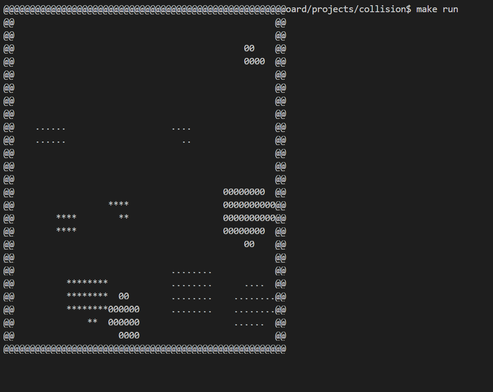

# ColliBox

An embedded fixed-point collision engine demo

---

for any system support 32-bit integer arithmetic and supporting following api:

```c
extern uint32_t rand_u16();
extern void render(uint32_t x, uint32_t y, uint32_t color);
extern uint32_t get_msec();
extern void sleep_msec(uint32_t msec);
```

, the code can be compiled into a collision engine demo that runs smoothly even on low-performance hardware, for verifying the hardware implementation. The code does not depend on libc or any other dependencies.

For example, with the API implemented in `native_shell.c` in the root directory, the code execution result is as follows:



## compile

```sh
make
```